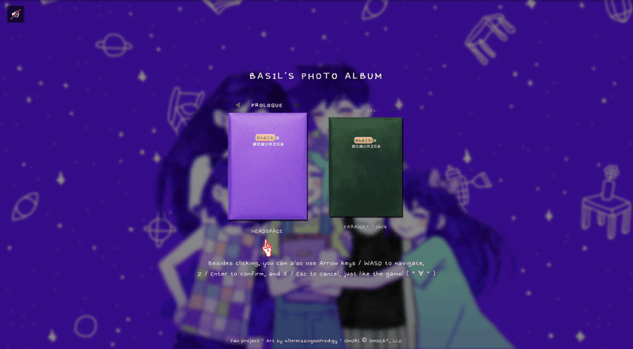
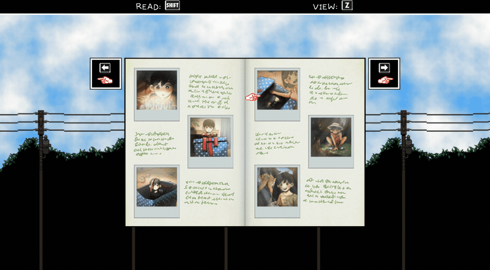

# OMORI Photo Album

A browser recreation of BASIL'S PHOTO ALBUM from [OMORI](https://www.omori-game.com/) — the menus, the typewriter text, the page-turn sounds, all of it.

**Live:** https://e-dal.github.io/omori-album/





> [!WARNING]
> **Major spoilers for OMORI**

## What's in it

FARAWAY TOWN, DREAM WORLD, and one more you'll have to find your own way into — every original photo, with all of BASIL's handwritten captions.

- **Story stages.** Each album can be viewed at different points in the story. Photos appear, vanish, and get scribbled over depending on where you are.
- **Game-accurate.** Page-turn animation, cursor blips, text blips, per-album BGM — timings ported frame-for-frame from OMORI's own RPG Maker plugin, not eyeballed.

## Controls

Everything works with the mouse, but it's built for the keyboard, like the game:

| Key | Action |
| --- | --- |
| Arrow keys / `WASD` | Navigate |
| `Z` / `Enter` / `Space` | Confirm / view photo |
| `X` / `Esc` | Cancel / back |
| `Shift` | Read the caption |

## Running it locally

There's no build step and no dependencies — it's one `index.html` with everything inlined. But you **can't** just double-click the file: it loads `assets/album_segments.json` with `fetch()`, and browsers block that over `file://`. Serve it over HTTP instead:

```bash
git clone https://github.com/E-Dal/omori-album.git
cd omori-album

python3 -m http.server 8000
# or: npx serve .
```

Then open http://localhost:8000

## Project structure

```text
.
├── index.html                  # everything — markup, CSS, and JS, all inlined
├── favicon.png
├── apple-touch-icon.png
└── assets/
    ├── album_segments.json     # all caption text for the three albums
    ├── thumbnails/             # album grid images
    ├── fullsize/               # full photo images
    ├── pages/                  # album page backgrounds
    ├── ui/                     # cursors, key prompts, OMORI fonts (.ttf)
    └── audio/                  # page turns, cursor blips, text blips (.ogg)
```

## Caption data format

All text lives in `assets/album_segments.json`, so you can edit captions without touching the code. It's keyed by album, and each photo is an array of *pages*, each page an array of *lines*:

```jsonc
{
  "faraway": [
    [                                  // photo 1
      [                                // page 1 of its caption
        {
          "text": "My first photo!",
          "inline": false,             // false = start a new line
          "dateLabel": "12/25 - CHRISTMAS"   // optional, shown as the date stamp
        },
        { "text": "It's my best friend, SUNNY, trying out his new violin.", "inline": false }
      ],
      [                                // page 2 — shown after the player advances
        { "text": "So exciting!", "inline": true }   // true = continue the same line
      ]
    ]
  ]
}
```

A segment can also carry `"effect": "distort"`, which switches it to the scratchy OMORI title font.

## Credits & permissions

- **OMORI** is © OMOCAT, LLC. This is a non-commercial fan project with no affiliation to, or endorsement by, OMOCAT. All original art, fonts, UI, and audio belong to them.
- **[Photo art](https://www.reddit.com/r/OMORI/comments/150eboa/friends_real/) by u/MrMissingNoProdigy**, used with permission (granted via Reddit DM, 2026-08-07) and credited in the site footer. It's used as a soft-focus backdrop behind the menu.

## License

The **code** in this repository is released under the [MIT License](LICENSE).

**The assets are not.** OMORI's sprites, fonts, and audio belong to OMOCAT, LLC; the photo illustrations belong to their artist. Neither is covered by the code license and neither may be redistributed.

## Colophon

The README and most of the code in `index.html` were written by [Claude](https://claude.ai), across a lot of back-and-forth. The caption transcription, the easter-egg design, and the small graphics tweaks are mine.
